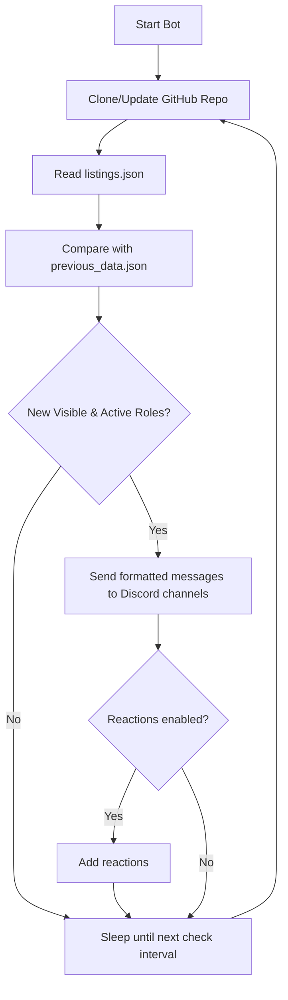

# Ch@d Internships
[](https://github.com/builtbybob/chatd-internships/actions)

## Overview

Ch@d Internships is an automated Discord bot that continuously monitors a public GitHub repository for new internship postings and delivers real-time updates to one or more Discord channels. Designed for reliability and ease of management, the bot is production-ready and supports Docker and systemd deployment.

**Key Features:**
- Automated repository sync and change detection
- Efficient comparison of new and previous listings to avoid duplicate posts
- Richly formatted Discord messages for new, visible, and active roles
- Optional reaction support for interactive user engagement
- Direct messaging of detailed job information when users react (if enabled)
- Robust error handling, retry logic, and channel health tracking
- Dynamic log level control for live debugging and monitoring
- Disk space and image management for safe operation on resource-constrained systems
- Modular architecture for easy extension and maintenance

The bot operates in a loop: it periodically pulls the latest data from the internships repository, processes new roles, sends notifications, and waits for the next interval. All operational commands and management scripts are exposed for easy control and monitoring.

### Bot Loop Overview



## � Quick Start

**For initial setup and installation, see [SETUP.md](docs/SETUP.md) for the complete step-by-step guide.**

### Prerequisites for Development

- Python 3.8 or higher
- Git
- Discord bot with Message Content Intent and Reactions Intent enabled
- One or more Discord channel IDs

### Development Setup

1. **Clone and setup virtual environment:**
   ```bash
   git clone https://github.com/builtbybob/chatd-internships.git
   cd chatd-internships
   
   # Create virtual environment
   python3 -m venv .venv
   
   # Activate virtual environment
   source .venv/bin/activate  # On Linux/Mac
   # OR
   .venv\Scripts\activate     # On Windows
   
   # Install dependencies
   pip install --upgrade pip
   pip install -r requirements.txt
   ```

2. **Configure environment:**
   ```bash
   cp .env.example .env
   # Edit .env with your Discord token and channel IDs
   ```

### Basic Configuration

The bot uses environment variables for configuration. Copy the `.env.example` file to `.env` and configure:

```ini
# Discord Bot Configuration (Required)
DISCORD_TOKEN=your_discord_bot_token_here
CHANNEL_IDS=123456789012345678,987654321098765432

# Bot Behavior
ENABLE_REACTIONS=false
MAX_RETRIES=3
CHECK_INTERVAL_MINUTES=1
MAX_POST_AGE_DAYS=5

# Logging Configuration
LOG_LEVEL=INFO
LOG_FILE=/app/logs/chatd.log
LOG_MAX_BYTES=10485760
LOG_BACKUP_COUNT=5
```


### Operations Quick Reference


#### Most Common Operations

**Start/Stop Bot**

```bash
chatd start   # Start the bot service (systemd)
chatd stop    # Stop the bot service
```

**Update Bot**

```bash
# Full update (auto git pull + smart rebuild + deploy)
sudo chatd update

# Alternative: Step-by-step deployment
sudo chatd build              # Auto git pull + smart build (skips if no changes)
sudo chatd deploy             # Restart service with latest image (fast ~8 seconds)
```

**Check Status**

```bash
chatd status  # Show bot/service status (active, running, errors)
```

**View Logs**

```bash
chatd logs -f   # View logs in real-time
chatd logs -n 100  # Show last 100 log lines
```

**Change Log Level**

```bash
chatd-loglevel debug    # Enable debug logging (no restart needed)
chatd-loglevel info     # Return to normal logging
chatd-loglevel warning  # Show only warnings/errors
```

For full details and advanced management, see:

👉 [OPERATIONS.md - Operations Guide](docs/OPERATIONS.md)

---

---

## Development

The bot is organized into modules:

- `chatd/config.py`: Configuration management
- `chatd/logging_utils.py`: Logging setup and management
- `chatd/repo.py`: GitHub repository handling
- `chatd/messages.py`: Message formatting
- `chatd/storage.py`: Data persistence
- `chatd/bot.py`: Discord bot and event handlers
- `main.py`: Entry point

### Running Tests

The project uses unittest for testing. Make sure your virtual environment is activated:

```bash
# Activate virtual environment first
source .venv/bin/activate

# Run all tests
python -m unittest discover tests/

# Run specific test modules
python -m unittest tests.test_bot
python -m unittest tests.test_config

# Run with verbose output
python -m unittest discover tests/ -v
```

## Log Management

The bot includes built-in log rotation via the `logging_utils.py` module:

- Automatically rotates logs when they reach the configured size
- Maintains the configured number of backup files
- Can be adjusted via environment variables

## 🔧 Troubleshooting & Log Management

### Dynamic Log Level Control

The bot supports **instant log level changes without restart**, perfect for production debugging:

```bash
# Enable debug logging for detailed troubleshooting
sudo chatd-loglevel debug

# View detailed logs in real-time
sudo chatd-logs -f

# Return to normal logging after debugging  
sudo chatd-loglevel info
```

**Available Log Levels:**
- `debug`: Maximum verbosity - shows all operations, git commands, API calls
- `info`: Normal operations - startup, shutdown, role processing
- `warning`: Warnings and errors only - for quiet production monitoring
- `error`: Error conditions only - for minimal logging
- `critical`: Critical failures only - for emergency situations

**Use Cases:**
- **Production Issues**: Instantly enable debug logging to investigate problems
- **Performance Monitoring**: Use warning level for clean production logs
- **Development**: Use debug level to see detailed operation flow
- **Troubleshooting**: No service restart required - maintain uptime while debugging

### Log Rotation

## Features

### Message Ordering and Processing

- **Chronological Processing**: Messages are processed in chronological order using a priority queue (heapq), ensuring posts appear in the correct sequence.
- **Date Filtering**: Only processes roles posted within the last 5 days to avoid spam from bulk updates.
- **Multi-Channel Support**: Can send messages to multiple Discord channels simultaneously.
- **Rate Limiting**: Includes built-in delays to prevent Discord API rate limiting.

### Reaction Processing (Optional Feature)

- **Configurable Reactions**: Use `ENABLE_REACTIONS=false` to disable reaction features for stability
- **Interactive Messages**: When enabled, the bot adds reactions to each message for user interaction
- **DM Support**: When users react to a message, they receive a detailed DM with more job information
- **Rich Formatting**: DMs include full job descriptions and application links

### Error Handling and Recovery

- **Channel Recovery**: Automatically retries failed channel messages up to configured MAX_RETRIES.
- **Channel Health Tracking**: Maintains a list of failed channels to avoid repeated failures.
- **Permission Handling**: Properly handles Discord permission errors and channel access issues.
- **Graceful Shutdown**: Handles SIGINT and SIGTERM signals for clean shutdown.

## License

This project is licensed under the GPL License - see the [LICENSE](LICENSE) file for details.

### Core Functions

#### Repository Management
- `clone_or_update_repo()`: Manages the local copy of the internships repository.
- `read_json()`: Parses the internship listings file.

#### Message Processing
- `format_message(role)`: Creates formatted Discord messages from role data.
- `normalize_role_key(role)`: Generates stable keys for role comparison.
- `compare_roles(old_role, new_role)`: Detects changes in role attributes.

#### Discord Integration
- `send_message(message, channel_id, role_key)`: Sends a message to a single channel.
- `send_messages_to_channels(message, role_key)`: Distributes messages to all configured channels.
- `check_for_new_roles()`: Main update detection and message dispatch logic.

### Scheduling

The bot checks for updates at configurable intervals (default: 1 minute) using the `schedule` library. The check interval can be adjusted using the `CHECK_INTERVAL_MINUTES` environment variable.
