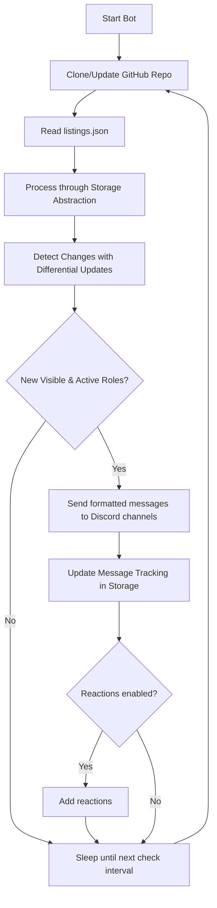
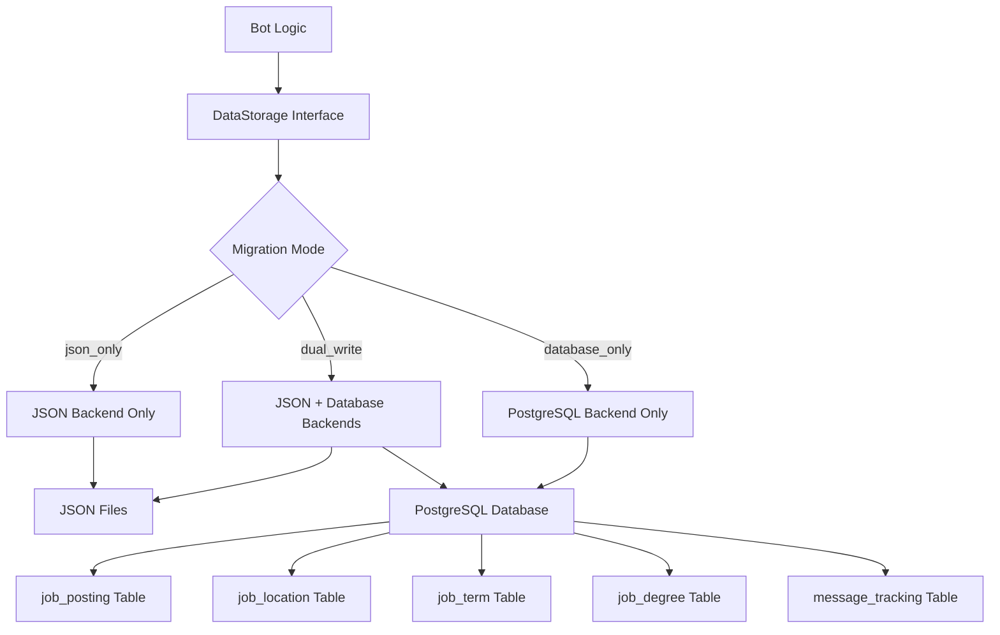

# Ch@d Internships
[](https://github.com/builtbybob/chatd-internships/actions)

## 🚀 Quick Start

**For initial setup and installation, see [SETUP.md](docs/SETUP.md) for the complete step-by-step guide.**

## Overview

Ch@d Internships is an automated Discord bot that continuously monitors a public GitHub repository for new internship postings and delivers real-time updates to one or more Discord channels. The bot features a robust PostgreSQL database backend with intelligent storage abstraction, enabling seamless migration from legacy JSON file storage to a scalable database solution.

**Key Features:**
- **Multi-Backend Storage**: PostgreSQL database with JSON file fallback and seamless migration
- **Storage Abstraction**: Three migration modes (json_only, dual_write, database_only) for zero-downtime transitions
- **Differential Updates**: Intelligent change detection preserving Discord message tracking integrity
- **Production Infrastructure**: Docker Compose orchestration with health checks and automatic recovery
- **Comprehensive Testing**: 124+ tests covering database models, storage abstraction, and migration workflows
- Automated repository sync and change detection
- Efficient comparison of new and previous listings to avoid duplicate posts
- Richly formatted Discord messages for new, visible, and active roles
- Optional reaction support for interactive user engagement
- Direct messaging of detailed job information when users react (if enabled)
- Robust error handling, retry logic, and channel health tracking
- Dynamic log level control for live debugging and monitoring
- Disk space and image management for safe operation on resource-constrained systems
- Modular architecture for easy extension and maintenance

The bot operates in a loop: it periodically pulls the latest data from the internships repository, processes new roles through the storage abstraction layer, sends notifications, and waits for the next interval. All operational commands and management scripts are exposed for easy control and monitoring.

### Bot Loop Overview


```mermaid
flowchart TD
   A[Start Bot] --> B[Clone/Update GitHub Repo]
   B --> C[Read listings.json]
   C --> D[Process through Storage Abstraction]
   D --> E[Detect Changes with Differential Updates]
   E --> F{New Visible & Active Roles?}
   F -- Yes --> G[Send formatted messages to Discord channels]
   F -- No --> M[Sleep until next check interval]
   G --> H[Update Message Tracking in Storage]
   H --> L{Reactions enabled?}
   L -- Yes --> I[Add reactions]
   I --> M
   L -- No --> M
   M --> B
```

### Storage Architecture

The bot now features a sophisticated storage abstraction layer supporting multiple backends:


```mermaid
flowchart TB
   A[Bot Logic] --> B[DataStorage Interface]
   B --> C{Migration Mode}
   C -- json_only --> D[JSON Backend Only]
   C -- dual_write --> E[JSON + Database Backends]
   C -- database_only --> F[PostgreSQL Backend Only]
   
   D --> G[JSON Files]
   E --> G
   E --> H[PostgreSQL Database]
   F --> H
   
   H --> I[job_posting Table]
   H --> J[job_location Table] 
   H --> K[job_term Table]
   H --> L[job_degree Table]
   H --> M[message_tracking Table]
```

## 🏗️ Storage Architecture

Ch@d Internships uses a sophisticated dual-storage system designed for reliability and performance during migration from JSON to PostgreSQL.

### Storage Modes

The bot supports three storage modes controlled by `MIGRATION_MODE`:

- **`json_only`**: Legacy mode using only JSON file storage
- **`dual_write`**: Migration mode - writes to both JSON and PostgreSQL, reads from JSON
- **`database_only`**: Target mode using only PostgreSQL database

### Efficient Database Operations

The database backend uses **surgical precision** for updates, avoiding expensive bulk operations:

#### Adding New Jobs
When a new job posting arrives:
```
Input: New job with 3 locations, 2 terms, 1 degree
Database Operations:
- 1 INSERT into job_posting table
- 3 INSERTs into job_location table  
- 2 INSERTs into job_term table
- 1 INSERT into job_degree table
- 1 INSERT into message_tracking table (when posted to Discord)
Total: 8 targeted INSERT operations
```

#### Updating Existing Jobs - Scalar Field Changes
When only scalar fields change (e.g., `active: true → false`, `sponsorship` updated):
```
Input: Job scalar field update (active, sponsorship, is_visible, etc.)
Database Operations:
- 1 SELECT to find existing job_posting record
- 1 UPDATE for changed scalar fields only (optimized single query)
- Related tables (locations/terms/degrees) untouched
- Message tracking preserved (no Discord repost)
Total: 2 operations for scalar-only changes
```

#### Full Content Refresh - date_updated Changes  
When `date_updated` changes (indicating content refresh from upstream):
```
Input: Job with date_updated change + potential location/term/degree changes
Database Operations:
- 1 SELECT to find existing job_posting record
- 1 UPDATE for all scalar fields (complete refresh)
- 1 SELECT to get existing locations/terms/degrees for comparison
- N DELETE operations for removed locations/terms/degrees (differential)
- M INSERT operations for new locations/terms/degrees (differential)
- Message tracking preserved (no Discord repost due to content accuracy)
Total: 3+ operations using differential updates to minimize database impact
```

**Example - Differential Content Refresh:**
```
Input: date_updated changed + locations changed from ["NYC", "SF", "LA"] to ["NYC", "Boston"]
Database Operations:
- 1 SELECT (find existing job_posting)
- 1 UPDATE (all scalar fields including date_updated)
- 1 SELECT (get existing locations: NYC, SF, LA)
- 2 DELETE operations (remove "SF" and "LA" - differential logic)
- 1 INSERT operation (add "Boston" - differential logic)
- "NYC" untouched (efficiency optimization)
Total: 6 operations using smart differential updates
```

#### Removing Jobs
When a job posting is deleted from upstream:
```
Input: Job removal from repository
Database Operations:
- 1 DELETE from job_posting (CASCADE handles related tables)
  - Automatically removes job_location entries
  - Automatically removes job_term entries
  - Automatically removes job_degree entries
  - Automatically removes message_tracking entries
Total: 1 DELETE with CASCADE cleanup
```

### Performance Benefits

**Old Approach (Inefficient):**
- Any change → Delete ALL jobs → Re-insert ALL jobs
- 1 new job = 1000+ DELETE + 1000+ INSERT operations
- No change detection = Full database rebuild every update

**New Approach (Intelligent Updates):**
- **Scalar Updates**: Only changed fields updated (active, sponsorship, etc.)
  - 1 scalar change = 2 operations (SELECT + UPDATE)
- **Content Refresh**: Differential updates when `date_updated` changes
  - 1 content refresh = 3-10 operations depending on data differences
  - **Differential Logic**: Only touches data that actually changed
  - **Preserved Data**: Existing locations/terms/degrees left untouched when unchanged
- **New Additions**: Surgical insertion of only new job postings
  - 1 new job = 8 operations (1 job + locations + terms + degrees + tracking)
- **Deletions**: Single CASCADE delete removes all related data
  - 1 job removal = 1 DELETE operation

**Performance Gains:**
- **99% fewer operations** for typical scalar updates (active status changes)
- **Differential efficiency** for content corrections (only updates changed data)
- **Preserved message tracking** eliminates duplicate Discord posts  
- **Smart change detection** prevents unnecessary database writes

## 🔍 Database Operations & Spot Checking

### Finding Job Postings by Discord Message ID

The bot tracks every Discord message it sends, allowing you to easily find the corresponding job posting:

```sql
-- Complete job posting lookup by Discord message ID
WITH job_info AS (
    SELECT jp.*, mt.message_id, mt.channel_id, mt.posted_at as discord_posted_at
    FROM job_postings jp
    JOIN message_tracking mt ON jp.id = mt.id
    WHERE mt.message_id = 'YOUR_MESSAGE_ID_HERE'
)
SELECT 
    ji.id,
    ji.company_name,
    ji.title,
    ji.url,
    ji.active,
    ji.sponsorship,
    ji.category,
    TO_TIMESTAMP(ji.date_posted) as date_posted_human,
    TO_TIMESTAMP(ji.date_updated) as date_updated_human,
    ji.message_id,
    ji.channel_id,
    ji.discord_posted_at,
    (SELECT ARRAY_AGG(location) FROM job_locations WHERE id = ji.id) as locations,
    (SELECT ARRAY_AGG(term) FROM job_terms WHERE id = ji.id) as terms,
    (SELECT ARRAY_AGG(degree) FROM job_degrees WHERE id = ji.id) as degrees
FROM job_info ji;
```

### Finding Job Postings by Job ID (UUID)

When you have a job ID from logs or need to look up a specific job posting:

```sql
-- Complete job posting lookup by Job ID (UUID)
WITH job_info AS (
    SELECT jp.*, mt.message_id, mt.channel_id, mt.posted_at as discord_posted_at
    FROM job_postings jp
    LEFT JOIN message_tracking mt ON jp.id = mt.id
    WHERE jp.id = 'YOUR_JOB_ID_HERE'
)
SELECT 
    ji.id,
    ji.company_name,
    ji.title,
    ji.url,
    ji.active,
    ji.sponsorship,
    ji.category,
    TO_TIMESTAMP(ji.date_posted) as date_posted_human,
    TO_TIMESTAMP(ji.date_updated) as date_updated_human,
    ji.message_id,
    ji.channel_id,
    ji.discord_posted_at,
    (SELECT ARRAY_AGG(location) FROM job_locations WHERE id = ji.id) as locations,
    (SELECT ARRAY_AGG(term) FROM job_terms WHERE id = ji.id) as terms,
    (SELECT ARRAY_AGG(degree) FROM job_degrees WHERE id = ji.id) as degrees
FROM job_info ji;
```

### Quick Database Health Checks

```sql
-- Count total jobs and active jobs
SELECT 
    COUNT(*) as total_jobs,
    COUNT(*) FILTER (WHERE active = true) as active_jobs,
    COUNT(*) FILTER (WHERE active = false) as inactive_jobs
FROM job_postings;

-- Recent job activity (last 24 hours)
SELECT 
    COUNT(*) as jobs_updated_24h
FROM job_postings 
WHERE TO_TIMESTAMP(date_updated) > NOW() - INTERVAL '24 hours';

-- Message tracking statistics
SELECT 
    COUNT(*) as total_discord_messages,
    COUNT(DISTINCT channel_id) as channels_used,
    MAX(posted_at) as last_message_posted
FROM message_tracking;
```

### Prerequisites for Development

- Python 3.8 or higher
- Git
- Discord bot with Message Content Intent and Reactions Intent enabled
- One or more Discord channel IDs
- **PostgreSQL 15+** (for database backend)
- **Docker and Docker Compose** (recommended for production deployment)

### Development Setup

#### Option 1: Database Development (Recommended)

1. **Clone and setup with PostgreSQL:**
   ```bash
   git clone https://github.com/builtbybob/chatd-internships.git
   cd chatd-internships
   
   # Start PostgreSQL with Docker Compose
   docker-compose up -d chatd-postgres
   
   # Create virtual environment
   python3 -m venv .venv
   source .venv/bin/activate  # On Linux/Mac
   # OR
   .venv\Scripts\activate     # On Windows
   
   # Install dependencies with PostgreSQL support
   pip install --upgrade pip
   pip install -r requirements.txt
   ```

2. **Configure for database mode:**
   ```bash
   cp examples/.env.example .env
   # Edit .env and set:
   # MIGRATION_MODE=database_only
   # DB_HOST=localhost
   # DB_PORT=5432
   # DB_NAME=chatd
   # DB_USER=chatd_user
   # DB_PASSWORD=your_secure_password
   ```

#### Option 2: JSON Development (Legacy Compatibility)

1. **Clone and setup virtual environment:**
   ```bash
   git clone https://github.com/builtbybob/chatd-internships.git
   cd chatd-internships
   
   # Create virtual environment
   python3 -m venv .venv
   source .venv/bin/activate  # On Linux/Mac
   # OR
   .venv\Scripts\activate     # On Windows
   
   # Install dependencies
   pip install --upgrade pip
   pip install -r requirements.txt
   ```

2. **Configure for JSON mode:**
   ```bash
   cp examples/.env.example .env
   # Edit .env and set:
   # MIGRATION_MODE=json_only
   ```

### Basic Configuration

The bot uses environment variables for configuration. Copy the `examples/.env.example` file to `.env` and configure:

```ini
# Discord Bot Configuration (Required)
DISCORD_TOKEN=your_discord_bot_token_here
CHANNEL_IDS=123456789012345678,987654321098765432

# Storage Backend Configuration
MIGRATION_MODE=database_only  # Options: json_only, dual_write, database_only

# PostgreSQL Database Configuration (when using database backend)
DB_HOST=localhost
DB_PORT=5432
DB_NAME=chatd
DB_USER=chatd_user
DB_PASSWORD=your_secure_password
DB_SSL_MODE=prefer

# Legacy JSON Storage (when using json_only or dual_write modes)
DATA_FILE=data/previous_data.json
MESSAGES_FILE=data/message_tracking.json

# Bot Behavior
ENABLE_REACTIONS=false
MAX_RETRIES=3
CHECK_INTERVAL_MINUTES=1
MAX_POST_AGE_DAYS=5

# Logging Configuration
LOG_LEVEL=INFO
LOG_FILE=/app/logs/chatd.log
LOG_MAX_BYTES=10485760
LOG_BACKUP_COUNT=5
```

### Migration Modes

The bot supports three migration modes for seamless transition between storage backends:

- **`json_only`**: Legacy mode using only JSON file storage (backward compatible)
- **`dual_write`**: Transition mode writing to both JSON and database (zero-downtime migration)
- **`database_only`**: Target mode using only PostgreSQL database (production recommended)

### Production Deployment with Docker

For production deployment, use Docker Compose which includes PostgreSQL, health checks, and automatic restart policies:

```bash
# Start full production stack
docker-compose up -d

# View logs
docker-compose logs -f chatd-bot

# Stop stack
docker-compose down
```

The Docker setup includes:
- PostgreSQL 15 database with optimized configuration
- Automatic database schema initialization
- Health checks for both database and bot services
- Persistent data volumes
- Environment-based configuration


### Operations Quick Reference


#### Most Common Operations

**Start/Stop Bot**

```bash
chatd start   # Start the bot service (systemd)
chatd stop    # Stop the bot service
```

**Update Bot**

```bash
# Full update (auto git pull + smart rebuild + deploy)
sudo chatd update

# Alternative: Step-by-step deployment
sudo chatd build              # Auto git pull + smart build (skips if no changes)
sudo chatd deploy             # Restart service with latest image (fast ~8 seconds)
```

**Check Status**

```bash
chatd status  # Show bot/service status (active, running, errors)
```

**View Logs**

```bash
chatd logs -f   # View logs in real-time
chatd logs -n 100  # Show last 100 log lines
```

**Change Log Level**

```bash
chatd-loglevel debug    # Enable debug logging (no restart needed)
chatd-loglevel info     # Return to normal logging
chatd-loglevel warning  # Show only warnings/errors
```

For full details and advanced management, see:

👉 [OPERATIONS.md - Operations Guide](docs/OPERATIONS.md)

---

---

## Development

The bot is organized into modules with a focus on storage abstraction and database integration:

### Core Modules

- `chatd/config.py`: Configuration management with database validation
- `chatd/logging_utils.py`: Logging setup and management
- `chatd/repo.py`: GitHub repository handling and data processing
- `chatd/messages.py`: Discord message formatting and delivery
- `chatd/storage_abstraction.py`: **NEW** - Multi-backend storage interface with migration support
- `chatd/database.py`: **NEW** - SQLAlchemy ORM models and database management
- `chatd/bot.py`: Discord bot, event handlers, and storage integration
- `main.py`: Entry point and service orchestration

### Database Schema

The PostgreSQL backend uses a normalized schema with strategic indexing:

```sql
-- Main job posting table
CREATE TABLE job_posting (
    id UUID PRIMARY KEY,
    url TEXT UNIQUE NOT NULL,
    company_name TEXT NOT NULL,
    title TEXT NOT NULL,
    date_updated TIMESTAMP,
    active BOOLEAN DEFAULT true,
    is_visible BOOLEAN DEFAULT true,
    sponsorship TEXT,
    source TEXT,
    date_posted TEXT,
    company_url TEXT,
    category TEXT
);

-- Related data tables (one-to-many relationships)
CREATE TABLE job_location (
    id UUID REFERENCES job_posting(id) ON DELETE CASCADE,
    location TEXT NOT NULL,
    PRIMARY KEY (id, location)
);

CREATE TABLE job_term (
    id UUID REFERENCES job_posting(id) ON DELETE CASCADE,
    term TEXT NOT NULL,
    PRIMARY KEY (id, term)
);

CREATE TABLE job_degree (
    id UUID REFERENCES job_posting(id) ON DELETE CASCADE,
    degree TEXT NOT NULL,
    PRIMARY KEY (id, degree)
);

-- Discord message tracking
CREATE TABLE message_tracking (
    id UUID PRIMARY KEY REFERENCES job_posting(id) ON DELETE CASCADE,
    message_id TEXT NOT NULL,
    channel_id TEXT NOT NULL,
    posted_at TIMESTAMP DEFAULT CURRENT_TIMESTAMP
);
```

### Storage Abstraction

The storage abstraction layer (`chatd/storage_abstraction.py`) provides:

1. **Abstract Interface**: Common methods across all storage backends
2. **JsonStorageBackend**: Legacy JSON file operations with optimizations
3. **DatabaseStorageBackend**: PostgreSQL operations with advanced features
4. **DataStorage**: Unified interface coordinating multiple backends
5. **Differential Updates**: Intelligent change processing preserving message tracking

### Running Tests

The project uses unittest for comprehensive testing including database operations, storage abstraction, and migration workflows. Make sure your virtual environment is activated:

```bash
# Activate virtual environment first
source .venv/bin/activate

# Run all tests
python -m unittest discover tests/

# Run specific test modules
python -m unittest tests.test_bot
python -m unittest tests.test_config
python -m unittest tests.test_database_models      # NEW: Database model tests
python -m unittest tests.test_storage_abstraction  # NEW: Storage abstraction tests
python -m unittest tests.test_migration           # NEW: Migration validation tests

# Run with verbose output
python -m unittest discover tests/ -v
```

### Test Coverage

The project includes 124+ comprehensive tests across multiple suites:

- **test_database_models.py**: Database model validation, relationships, and constraints
- **test_storage_abstraction.py**: Multi-backend storage operations and migration modes
- **test_migration.py**: Data migration validation, rollback, and integrity checks
- **test_update_support.py**: Differential update workflows and change detection
- **test_validation.py**: Data integrity and constraint validation
- **test_bot.py**: Discord bot functionality and storage integration
- **test_repo.py**: Repository handling and data processing
- **test_config.py**: Configuration validation including database settings

### Database Migration

For migrating from JSON to PostgreSQL in production:

```bash
# 1. Start in dual_write mode (writes to both backends)
export MIGRATION_MODE=dual_write

# 2. Run migration script to populate database with historical data
python scripts/migrate_json_to_database.py

# 3. Validate data consistency
python scripts/migrate_json_to_database.py --validate

# 4. Switch to database_only mode
export MIGRATION_MODE=database_only
```

## Log Management

The bot includes built-in log rotation via the `logging_utils.py` module:

- Automatically rotates logs when they reach the configured size
- Maintains the configured number of backup files
- Can be adjusted via environment variables

## 🔧 Troubleshooting & Log Management

### Dynamic Log Level Control

The bot supports **instant log level changes without restart**, perfect for production debugging:

```bash
# Enable debug logging for detailed troubleshooting
sudo chatd-loglevel debug

# View detailed logs in real-time
sudo chatd-logs -f

# Return to normal logging after debugging  
sudo chatd-loglevel info
```

**Available Log Levels:**
- `debug`: Maximum verbosity - shows all operations, git commands, API calls
- `info`: Normal operations - startup, shutdown, role processing
- `warning`: Warnings and errors only - for quiet production monitoring
- `error`: Error conditions only - for minimal logging
- `critical`: Critical failures only - for emergency situations

**Use Cases:**
- **Production Issues**: Instantly enable debug logging to investigate problems
- **Performance Monitoring**: Use warning level for clean production logs
- **Development**: Use debug level to see detailed operation flow
- **Troubleshooting**: No service restart required - maintain uptime while debugging

### Log Rotation

## Architecture & Performance

### Storage Architecture Benefits

**PostgreSQL Backend Advantages:**
- **Scalability**: Handles growth in job postings and Discord channels efficiently
- **Performance**: Strategic indexing and optimized queries for fast data access
- **Reliability**: ACID transactions and data integrity guarantees
- **Analytics**: SQL queries enable job market analysis and reporting capabilities
- **Concurrent Access**: Multiple bot instances can safely share the same database

**Storage Abstraction Benefits:**
- **Zero-Downtime Migration**: Seamless transition from JSON to PostgreSQL
- **Backward Compatibility**: Full support for existing JSON-based deployments
- **Flexible Deployment**: Choose the right storage backend for your environment
- **Future-Proof**: Easy to add new storage backends (Redis, MongoDB, etc.)

### Differential Update System

The bot implements an intelligent update system that preserves Discord message tracking:

- **Change Detection**: Compares current vs. previous job data efficiently
- **Selective Updates**: Updates only changed fields (e.g., active status, visibility)
- **Content Corrections**: Full refresh workflow when `date_updated` changes
- **Message Preservation**: Maintains Discord message links across updates
- **Idempotent Operations**: Safe to run multiple times without side effects

### Performance Optimizations

**Database Level:**
- Strategic indexing on frequently queried fields (active, company_name, date_updated)
- Normalized schema reducing data duplication
- UUID primary keys for improved JOIN performance
- Connection pooling for concurrent operations

**Application Level:**
- Differential updates avoiding bulk data replacement
- Change detection minimizing unnecessary database writes
- Intelligent caching in storage abstraction layer
- Batch processing for large datasets

## Features

### Message Ordering and Processing

- **Chronological Processing**: Messages are processed in chronological order using a priority queue (heapq), ensuring posts appear in the correct sequence.
- **Date Filtering**: Only processes roles posted within the last 5 days to avoid spam from bulk updates.
- **Multi-Channel Support**: Can send messages to multiple Discord channels simultaneously.
- **Rate Limiting**: Includes built-in delays to prevent Discord API rate limiting.

### Reaction Processing (Optional Feature)

- **Configurable Reactions**: Use `ENABLE_REACTIONS=false` to disable reaction features for stability
- **Interactive Messages**: When enabled, the bot adds reactions to each message for user interaction
- **DM Support**: When users react to a message, they receive a detailed DM with more job information
- **Rich Formatting**: DMs include full job descriptions and application links

### Error Handling and Recovery

- **Channel Recovery**: Automatically retries failed channel messages up to configured MAX_RETRIES.
- **Channel Health Tracking**: Maintains a list of failed channels to avoid repeated failures.
- **Permission Handling**: Properly handles Discord permission errors and channel access issues.
- **Graceful Shutdown**: Handles SIGINT and SIGTERM signals for clean shutdown.

## License

This project is licensed under the GPL License - see the [LICENSE](LICENSE) file for details.

### Core Functions

#### Storage Management
- `DataStorage`: Unified storage interface supporting multiple backends
- `detect_job_changes()`: Intelligent change detection with differential updates
- `process_job_changes()`: Efficient update processing preserving message tracking
- `update_job_posting_with_refresh()`: Content correction workflow for database backend

#### Repository Management
- `clone_or_update_repo()`: Manages the local copy of the internships repository
- `read_json()`: Parses the internship listings file
- `process_job_changes()`: Handles data through storage abstraction layer

#### Message Processing
- `format_message(role)`: Creates formatted Discord messages from role data
- `normalize_role_key(role)`: Generates stable keys for role comparison
- `compare_roles(old_role, new_role)`: Detects changes in role attributes

#### Discord Integration
- `send_message(message, channel_id, role_key)`: Sends a message to a single channel
- `send_messages_to_channels(message, role_key)`: Distributes messages to all configured channels
- `check_for_new_roles()`: Main update detection and message dispatch logic with storage integration

#### Database Operations (PostgreSQL Backend)
- `DatabaseManager`: SQLAlchemy session management and connection handling
- `job_posting_from_dict()` / `job_posting_to_dict()`: ORM conversion utilities
- `update_job_posting_scalars()`: Efficient scalar field updates
- `add_message_tracking()`: Discord message tracking in database

### Scheduling

The bot checks for updates at configurable intervals (default: 1 minute) using the `schedule` library. The check interval can be adjusted using the `CHECK_INTERVAL_MINUTES` environment variable.

## Monitoring & Health Checks

### Storage Backend Health

The bot includes comprehensive health monitoring for all storage backends:

```bash
# Check storage backend status
python -c "
from chatd.config import load_config
from chatd.storage_abstraction import DataStorage
config = load_config()
storage = DataStorage(config)
print('Backend Status:', storage.get_backend_status())
print('Health Check:', storage.health_check())
"
```

### Database Monitoring

When using PostgreSQL backend, monitor these key metrics:

- **Connection Health**: Automatic connection testing and recovery
- **Query Performance**: Indexed queries for optimal response times
- **Data Integrity**: Foreign key constraints and transaction safety
- **Storage Growth**: Monitor database size and implement retention policies

### Migration Monitoring

During migration from JSON to PostgreSQL:

- **Data Consistency**: Compare record counts between backends
- **Performance Impact**: Monitor query response times during dual_write mode
- **Error Tracking**: Comprehensive logging of migration progress and issues
- **Rollback Readiness**: Immediate fallback to JSON mode if needed

### Production Deployment Health

Docker Compose includes built-in health checks:

```yaml
healthcheck:
  test: ["CMD-EXEC", "pg_isready -U ${DB_USER} -d chatd"]
  interval: 30s
  timeout: 5s
  retries: 5
```

The bot automatically falls back to JSON mode if database connectivity issues are detected, ensuring continuous operation even during infrastructure problems.
