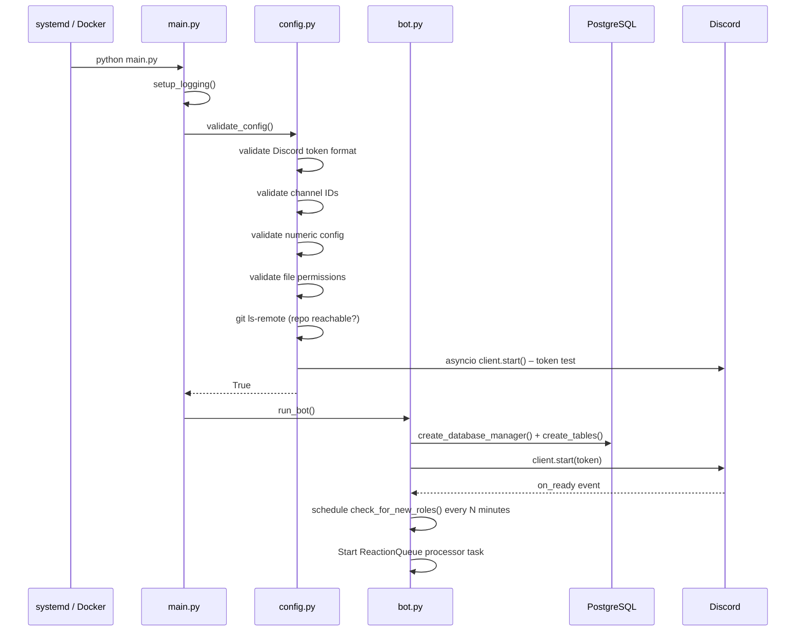
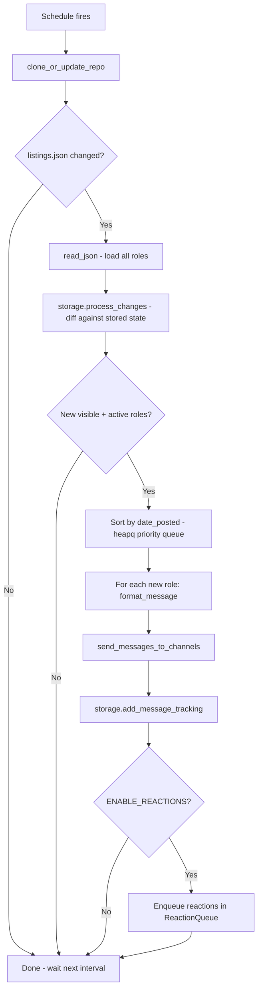

# Ch@d Internships — Architecture

This document describes the internal architecture of the Ch@d Internships Discord bot: how the modules are organized, how data flows through the system, and the key design decisions that shape the codebase.

---

## Table of Contents

1. [High-Level Overview](#high-level-overview)
2. [Module Map](#module-map)
3. [Runtime Control Flow](#runtime-control-flow)
4. [Storage Layer](#storage-layer)
5. [Discord Reaction System](#discord-reaction-system)
6. [Configuration System](#configuration-system)
7. [Logging System](#logging-system)
8. [Database Schema](#database-schema)
9. [Key Design Decisions](#key-design-decisions)

---

## High-Level Overview

Ch@d Internships is a **polling bot**: every `CHECK_INTERVAL_MINUTES` it fetches the latest state of a GitHub-hosted JSON file, computes a diff against its stored state, and posts any new, active, visible job postings to one or more Discord channels.

```
┌─────────────────────────────────────────────────────────────┐
│                        Host / Docker                        │
│                                                             │
│  ┌───────────┐     ┌──────────────┐     ┌───────────────┐  │
│  │  systemd  │────▶│  main.py     │────▶│   bot.py      │  │
│  │  service  │     │  (entrypoint)│     │  (Discord bot)│  │
│  └───────────┘     └──────────────┘     └──────┬────────┘  │
│                                                 │           │
│         ┌───────────────────────────────────────┤           │
│         │               │               │       │           │
│   ┌─────▼────┐   ┌──────▼──────┐  ┌────▼────┐  │           │
│   │ repo.py  │   │ storage_    │  │messages │  │           │
│   │(git pull)│   │abstraction  │  │.py      │  │           │
│   └──────────┘   └──────┬──────┘  └─────────┘  │           │
│                         │                        │           │
│               ┌─────────┴──────────┐             │           │
│               │                    │             │           │
│        ┌──────▼──────┐    ┌────────▼───────┐    │           │
│        │  JSON files │    │  database.py   │    │           │
│        │  (legacy)   │    │  (PostgreSQL)  │    │           │
│        └─────────────┘    └────────────────┘    │           │
│                                                 │           │
└─────────────────────────────────────────────────┘
```

**External dependencies:**
- **GitHub** — `SimplifyJobs/Summer2026-Internships` repository (or any configurable repo), read via `git pull`
- **Discord API** — posting messages, adding reactions, sending DMs, receiving reaction events

---

## Module Map

```
chatd-internships/
├── main.py                      # Entry point: logging setup → config validation → run_bot()
└── chatd/
    ├── config.py                # Singleton Config class; all env-var parsing & validation
    ├── logging_utils.py         # Logging setup, rotation, runtime log-level change via SIGHUP
    ├── repo.py                  # git clone / pull; reads listings.json
    ├── messages.py              # Discord message formatting; role comparison helpers
    ├── storage.py               # Legacy FileStorage (Storage ABC) — used only in older code paths
    ├── storage_abstraction.py   # Current multi-backend interface: DataStorage, JsonStorageBackend,
    │                            #   DatabaseStorageBackend, + differential update logic
    ├── database.py              # SQLAlchemy ORM models + DatabaseManager
    └── bot.py                   # discord.Client subclass; scheduling loop; reaction handling;
                                 #   application tracking; company info DMs
```

### Responsibility summary

| Module | Responsibility |
|---|---|
| `main.py` | Bootstraps logging, validates config, starts the event loop via `run_bot()` |
| `config.py` | Reads all env vars, provides a typed `Config` singleton, validates Discord/DB/numeric settings |
| `logging_utils.py` | Configures root logger with console + rotating-file handlers; supports runtime level changes |
| `repo.py` | Manages the local git clone of the internship repo; returns `True` when `listings.json` changes |
| `messages.py` | `format_message()`, `compare_roles()`, timezone-aware epoch formatting, generic title generation |
| `storage.py` | Legacy `FileStorage` / `Storage` ABC — superseded by `storage_abstraction.py` |
| `storage_abstraction.py` | `DataStorage` facade that routes reads/writes to JSON, database, or both backends |
| `database.py` | SQLAlchemy ORM models; `DatabaseManager` context-manager sessions |
| `bot.py` | Core bot loop, reaction queue, company-info DMs, application tracking, Discord event handlers |

---

## Runtime Control Flow

### Startup sequence (`main.py` → `bot.py`)



### Main polling loop (`check_for_new_roles`)



### Change detection detail (`storage_abstraction.py`)

The `detect_job_changes()` function compares the upstream JSON with stored state and categorises each job into one of four buckets:

| Bucket | Condition | Action |
|---|---|---|
| **new** | ID not in stored state | Insert, post to Discord |
| **scalar_updated** | ID exists, scalar fields differ but `date_updated` unchanged | UPDATE scalar fields only (2 DB ops) |
| **content_refresh** | ID exists, `date_updated` changed | Full scalar UPDATE + differential location/term/degree sync |
| **soft_deleted** | ID missing from upstream JSON | Set `is_deleted = True`; preserve Discord reactions |

---

## Storage Layer

### Three-mode abstraction

```
Config: MIGRATION_MODE = json_only | dual_write | database_only
                              │
                     DataStorage (facade)
                    ┌──────────┼──────────┐
                    │          │           │
             json_only     dual_write  database_only
                    │          │           │
          ┌─────────┘     ┌────┴────┐      └─────────┐
          ▼               ▼         ▼                 ▼
  JsonStorageBackend  JsonSB  DatabaseSB        DatabaseSB
                         (writes to both, reads from JSON)
```

`JsonStorageBackend` wraps `previous_data.json` and `message_tracking.json`.

`DatabaseStorageBackend` wraps a `DatabaseManager` instance (SQLAlchemy sessions over PostgreSQL).

`DataStorage` routes each operation through whichever backends are active for the current `MIGRATION_MODE`.

### Differential update strategy

When `date_updated` changes for an existing job, the system does *surgical* updates:

```
Stored locations: [NYC, SF, LA]
Upstream:         [NYC, Boston]

→ DELETE SF, LA
→ INSERT Boston
→ NYC untouched (intersection)
```

This avoids the naive approach of DELETE-all then INSERT-all, which was expensive (1000+ ops per update cycle).

---

## Discord Reaction System

### ReactionQueue (`bot.py`)

When reactions are enabled (`ENABLE_REACTIONS=true`), reactions are not added synchronously after posting. Instead they are placed on an `asyncio.Queue` and processed by a background coroutine:

```
post message → enqueue (message_id, emoji, retries=0) → _process_reactions()
                                                              │
                                          ┌───────────────────┴──────────────────┐
                                          │                                       │
                                  classify failure                        success → done
                                          │
                              ┌───────────┼────────────────┐
                              │           │                 │
                         PERMANENT    RATE_LIMITED      NETWORK/SERVER
                              │           │                 │
                           skip       delay × retry     retry with backoff
```

`ReactionFailureType` categories:
- `PERMANENT_ERROR` (403/404) — skip, do not retry
- `RATE_LIMITED` (429) — honour `retry_after` header
- `SERVER_ERROR` (5xx) — exponential backoff
- `NETWORK_ERROR` — retry up to `REACTION_RETRY_COUNT`
- `UNKNOWN_ERROR` — limited retry

Health monitoring uses a **rolling window** of the last `HEALTH_WINDOW_SIZE` attempts. If failure rate exceeds `DEGRADATION_THRESHOLD` (50%), the queue enters degraded mode (longer delays). It recovers when failure rate drops below `RECOVERY_THRESHOLD` (20%).

A **circuit breaker** activates after `CIRCUIT_BREAKER_THRESHOLD` consecutive failures and suspends all reactions for `CIRCUIT_BREAKER_TIMEOUT_SECONDS` before retrying.

### Reaction event handlers

`on_raw_reaction_add` dispatches to two handlers:

| Emoji | Handler |
|---|---|
| `❓` (configurable) | `handle_company_info_reaction` — sends DM with company's recent active jobs |
| `📝` (configurable) | `handle_application_tracking_reaction` — records application in `student_applications` table; sends congratulatory DM with tip |

---

## Configuration System

`chatd/config.py` implements a **singleton** `Config` class. On first instantiation it:
1. Calls `load_dotenv()` to read `.env`
2. Iterates `DEFAULT_CONFIG` and sets attributes — env vars override defaults unless empty
3. Parses composite types: `CHANNEL_IDS` (comma-split list), `MESSAGE_REACTIONS` (comma-split list)
4. Converts strings to typed values (int, float, bool)

Validation runs in `config.validate()` before the bot starts. Validators:

| Validator | Checks |
|---|---|
| `_validate_discord_token` | Length ≥ 50 chars, contains `.` |
| `_validate_channel_ids` | All integers, 16-20 digits (Discord snowflake) |
| `_validate_numeric_config` | Ranges for `MAX_POST_AGE_DAYS`, `CHECK_INTERVAL_MINUTES`, `MAX_RETRIES` |
| `_validate_file_permissions` | All data/log directories are writable (creates if needed) |
| `_validate_repository` | `git ls-remote` succeeds on `REPO_URL` |
| `_validate_discord_connection` | Connects with token, checks channel permissions |
| `_validate_database_config` | Only when `MIGRATION_MODE != json_only`; verifies password, pool size, batch size |
| `_validate_message_reactions` | 1–10 emojis, no duplicates, max 50 chars each |

---

## Logging System

`chatd/logging_utils.py` configures the **root logger** with:
- **Console handler** (always)
- **RotatingFileHandler** (when `LOG_FILE` is set) — default 10 MB max, 5 backups

Runtime log-level changes work **without a restart**:
```
chatd-loglevel debug
# → writes "DEBUG" to /tmp/chatd_loglevel
# → sends SIGHUP to the bot process
# → SIGHUP handler reads the file and calls change_log_level()
```

Log format: `[YYYY-MM-DD HH:MM:SS LEVEL module:line] message`

---

## Database Schema

Managed by SQLAlchemy ORM (`chatd/database.py`). Tables in PostgreSQL:

```
job_postings (primary)
  id UUID PK
  url TEXT UNIQUE
  company_name TEXT (indexed)
  title TEXT
  date_posted BIGINT (indexed)
  date_updated BIGINT (indexed)
  active BOOLEAN (indexed)
  is_visible BOOLEAN (indexed)
  is_deleted BOOLEAN (indexed)   ← soft delete
  sponsorship TEXT
  source TEXT
  company_url TEXT
  category TEXT (indexed)

job_locations (one-to-many → job_postings)
  id UUID FK → job_postings.id CASCADE
  location TEXT
  PK (id, location)

job_terms (one-to-many)
  id UUID FK → job_postings.id CASCADE
  term TEXT
  PK (id, term)

job_degrees (one-to-many)
  id UUID FK → job_postings.id CASCADE
  degree TEXT
  PK (id, degree)

message_tracking (one-to-one)
  id UUID FK → job_postings.id CASCADE
  message_id TEXT (indexed)
  channel_id TEXT (indexed)
  posted_at TIMESTAMP (indexed)

student_applications
  id UUID PK (generated)
  job_id UUID FK → job_postings.id CASCADE
  discord_user_id TEXT (indexed)
  applied_at TIMESTAMP (indexed)
  UNIQUE (job_id, discord_user_id)
```

**Soft delete**: when a job is removed from the upstream repository, `is_deleted` is set to `True` rather than deleting the row. This preserves:
- Discord reaction lookups (`on_raw_reaction_add` finds the job by `message_id`)
- `student_applications` records (FK would cascade-delete otherwise)
- Historical analytics

Normal queries filter `WHERE is_deleted = false`; reaction handlers do not filter on `is_deleted`.

---

## Key Design Decisions

### Why a storage abstraction layer?

The project migrated from flat JSON files to PostgreSQL. To do this without downtime, a three-mode abstraction was introduced:
- `json_only` — no database dependency, backward-compatible
- `dual_write` — both backends receive writes; reads come from JSON (safe cutover)
- `database_only` — JSON files no longer written

This allowed incremental validation at each stage.

### Why soft delete instead of hard delete?

Discord messages sent by the bot contain reactions. If a job is hard-deleted, any user clicking a reaction on an old message would get a "job not found" error. Soft delete preserves the row — and its `message_tracking` FK — so reactions keep working indefinitely.

### Why a priority queue for message posting?

When many new jobs arrive simultaneously (e.g., after a large upstream batch update), posting them in random order would confuse users. `heapq` sorts by `date_posted` so messages appear chronologically in Discord.

### Why schedule (not asyncio periodic tasks)?

The `schedule` library is thread-safe and human-readable (`schedule.every(1).minutes.do(...)`). It runs in the same thread as the sync scheduling wrapper. The bot uses `asyncio.run_coroutine_threadsafe` to bridge into the async Discord loop.

### Why signal-based log level changes?

Restarting the bot to change log verbosity would interrupt the Discord connection and potentially miss a polling window. SIGHUP is the conventional Unix signal for "reload config" — the handler reads a temp file written by the `chatd-loglevel` management command.
